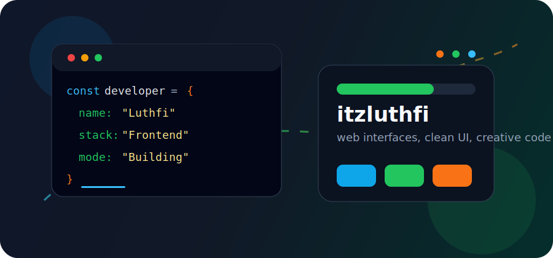
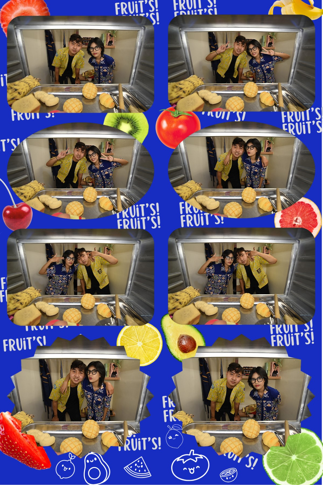

<div align="center">


<br />


</div>

---

<div align="center">



</div>

---

## About Me

```ts
const luthfi = {
  name: "Luthfi",
  username: "itzluthfi",
  focus: ["Web Development", "Frontend UI", "Clean Code"],
  currentlyLearning: ["JavaScript", "React", "Tailwind CSS"],
  goal: "Build useful, clean, and good-looking digital products",
};
```

- I like building modern, responsive, and interactive web interfaces.
- I enjoy improving projects little by little until they feel polished.
- I am currently sharpening my frontend and web development skills.

---

## Tech Stack

<div align="center">


</div>

---

## UI & Tools

<div align="center">


</div>

---

## Featured Photo

<div align="center">



</div>

---

## GitHub Stats

<div align="center">


<br />


</div>

---

## Profile Summary

<div align="center">


<br />


<br />


</div>

---

## GitHub Trophy

<div align="center">


</div>

---

## Activity Graph

<div align="center">


</div>

---

## Contribution Snake

<div align="center">

<picture>
  <source media="(prefers-color-scheme: dark)" srcset="https://raw.githubusercontent.com/itzluthfi/itzluthfi/output/github-contribution-grid-snake-dark.svg" />
  <source media="(prefers-color-scheme: light)" srcset="https://raw.githubusercontent.com/itzluthfi/itzluthfi/output/github-contribution-grid-snake.svg" />
  
</picture>

</div>

---

## Random Dev Quote

<div align="center">


</div>

---

## Connect With Me

<div align="center">

<a href="https://github.com/itzluthfi">
  
</a>
<a href="https://www.instagram.com/itzluthfi">
  
</a>
<a href="mailto:luthfishidqi2@gmail.com">
  
</a>

</div>

<br />

<div align="center">


</div>
